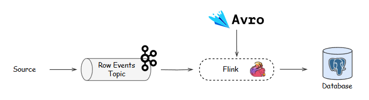

# Real-Time Data Processing System

This project implements a real-time data processing system using Apache Flink, Apache Kafka, and PostgreSQL to process and analyze user interaction events.

## System Overview

The system processes two types of events in real-time:
- Click Events: User interactions with products (browsing behavior)
- Buy Events: Product purchase transactions

Events are serialized using Avro schema and sent to Kafka topics, ensuring data consistency and compatibility through Schema Registry.

## System Architecture



### Components

- **Apache Kafka**: Message queue system for event streaming
- **Schema Registry**: Manages Avro schemas for data consistency
- **Apache Flink**: Real-time stream processing framework
- **PostgreSQL**: Relational database for processed data storage

## Project Structure

```
.
├── avro_schema/              # Avro schema definitions
│   ├── click_events.avsc     # Schema for click events
│   └── buy_events.avsc       # Schema for purchase events
├── generate_data/            # Data generation scripts
│   ├── main.py              # Main script for event generation
│   └── requirements.txt      # Python dependencies
├── src/                      # Source code
│   └── main/                 # Main application code
└── docker-compose.yml        # Docker services configuration
```

## Prerequisites

- Docker and Docker Compose
- Java Development Kit (JDK) 11 or later
- Python 3.7 or later
- Maven

## Setup Instructions

1. Clone the repository:
```bash
git clone <repository-url>
cd DETrungnam
```

2. Start the infrastructure services:
```bash
docker-compose up -d
```

3. Install Python dependencies for data generation:
```bash
cd generate_data
pip install -r requirements.txt
```

4. Build and run the Flink application:
```bash
mvn clean package
java -jar avro-tools-1.11.0.jar compile schema avro_schema/buy_events.avsc src/main/java
flink run target/your-jar-name.jar
```

## Data Schema

### Click Event Schema
```json
{
  "type": "record",
  "name": "ClickEvent",
  "namespace": "com.events",
  "fields": [
    {"name": "sessionId", "type": "string"},
    {"name": "timestamp", "type": "string"},
    {"name": "itemId", "type": "string"},
    {"name": "category", "type": "string"}
  ]
}
```

### Buy Event Schema
```json
{
  "type": "record",
  "name": "BuyEvent",
  "namespace": "com.events",
  "fields": [
    {"name": "sessionId", "type": "string"},
    {"name": "timestamp", "type": "string"},
    {"name": "itemId", "type": "string"},
    {"name": "price", "type": "int"},
    {"name": "quantity", "type": "int"}
  ]
}
```

## Service Configuration

The system uses the following ports:
- Kafka: 9092
- Schema Registry: 8082
- PostgreSQL: 5432
- Zookeeper: 2181

## Data Flow

1. The data generator creates simulated click and purchase events
2. Events are serialized using Avro and published to Kafka topics
3. Flink jobs consume events from Kafka and process them in real-time
4. Processed data is stored in PostgreSQL tables for further analysis

## Development

To generate test data:
```bash
cd generate_data
python main.py
```

To monitor Kafka topics:
```bash
kafka-console-consumer --bootstrap-server localhost:9092 --topic click_events --from-beginning
kafka-console-consumer --bootstrap-server localhost:9092 --topic buy_events --from-beginning
```